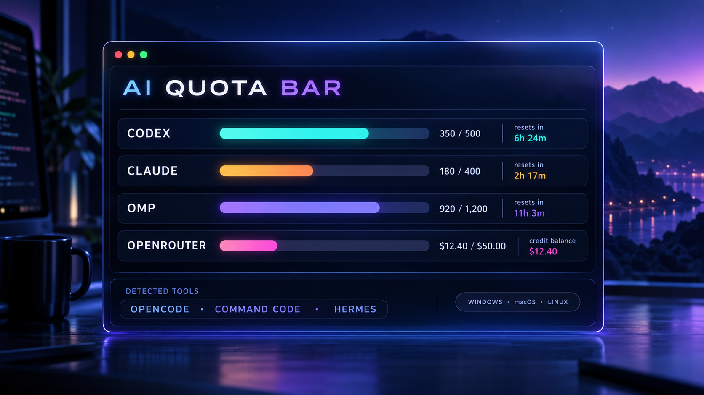
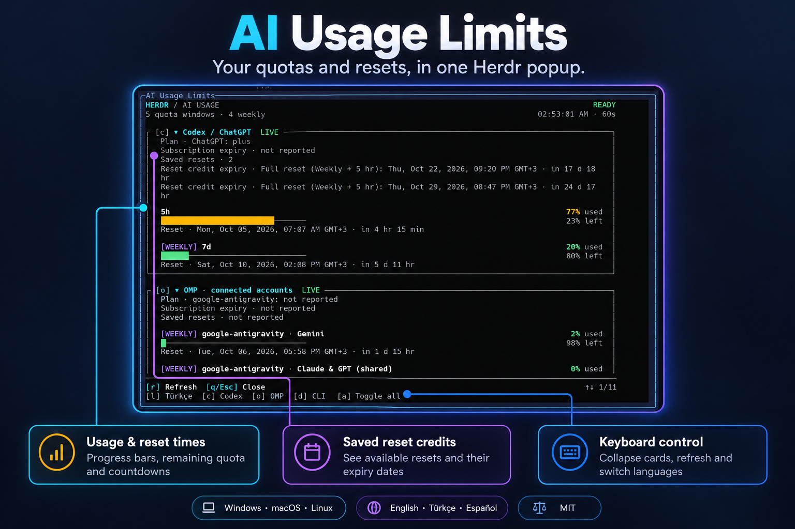

# Herdr AI Quota Bar



*Illustrative preview: values shown are examples. OpenCode, Command Code and Hermes are detected; live quota bars depend on an available source.*

[](#install)
[](#languages)
[](https://github.com/tunaunuvar/herdr_usage_plugin/tree/v0.7.3)
[](LICENSE)

**One panel for mixed AI setups.** It detects 19 AI CLIs—including OpenCode, Command Code, and Hermes—and shows live quota bars wherever a reliable usage source is available. Unsupported sources remain visible as clear info cards; the plugin does not invent percentages. Runs on Windows, macOS, and Linux with no third-party package dependencies.



*An annotated capture of the real panel; quota values belong to the captured moment.* [View the original screenshot](docs/assets/panel-screenshot.png).

Open one popup to see **how much quota remains**, **when limits reset**, and **when saved reset credits expire**. Fold cards with a keypress and switch between English, Turkish and Spanish.

**Live quota bars:** Codex, connected OMP providers, Claude Code through OMP or its statusline bridge, and OpenRouter credits with a management key. **Also detected:** OpenCode, Command Code, Hermes, Gemini CLI, Amp, Cursor Agent, Copilot CLI, Aider, Pi, Goose, Crush, Kiro, Qwen Code, Kimi CLI, LLM CLI, and Ollama.

## What it shows

- Codex account rate limits from Codex's local `app-server` RPC.
- Quota windows returned by authenticated providers in Oh My Pi (OMP). OMP account identifiers are requested in redacted form.
- Saved rate-limit reset counts and individual reset-credit expiry dates reported by Codex or any OMP provider. Zero and unavailable data are shown differently. The panel only reads this inventory; it does not redeem resets.
- Reported plan names. Subscription/billing expiry is displayed as `not reported`: the integrated interfaces do not currently expose that date. OAuth token expiry and quota reset dates are not subscription expiry dates.
- A separate Claude card, automatically populated from Anthropic reports in OMP, or from the optional Claude Code statusline bridge below.
- OpenRouter purchased and used credits via its official credits endpoint when `OPENROUTER_MANAGEMENT_KEY` is set in the Herdr server environment. This is a credit balance, not a subscription quota or reset window.
- Installed AI CLI names discovered on the `PATH` inherited by the Herdr server.

The panel checks for Codex, OMP, Claude Code, Gemini CLI, Amp, OpenCode, Command Code, Cursor Agent, GitHub Copilot CLI, Aider, Hermes, Pi, Goose, Crush, Kiro CLI, Qwen Code, Kimi CLI, LLM CLI, and Ollama. Detected tools get their own panel card. Where no stable quota interface is available, the card says so rather than inventing numbers. Command Code exposes live meters in its CLI's `/usage` command; OpenCode provider sign-ins do not themselves expose account quotas.

Gemini CLI's `/stats model`, Amp's `amp usage`, and Command Code's `/usage` are shown as manual hints when those tools are detected. The plugin does not run those commands. Other detected agents show explicitly that their plan, expiry and saved-reset data has no adapter.

## Install

Requires Herdr 0.9.0+ and Node.js on the Herdr server's `PATH`. Install from GitHub:

```sh
herdr plugin install tunaunuvar/herdr_usage_plugin
herdr plugin action invoke open --plugin tunaunuvar.herdr-usage-limits
```

Codex and/or OMP must be installed and signed in for live queries; Claude Code can instead supply snapshots through the bridge below. The discovery list is scanned when the popup starts; close and reopen it after installing another CLI.

Optional shortcut (`prefix` then `u`, Ctrl+B then `u` by default), add to Herdr's `config.toml`:

```toml
[[keys.command]]
key = "prefix+u"
type = "plugin_action"
command = "tunaunuvar.herdr-usage-limits.open"
description = "Open AI usage limits"
```

Then run `herdr server reload-config`.

## Use

Press `c` or `o` to collapse/expand Codex or OMP, `d` to collapse/expand detected tools, `a` to toggle all sections, `r` to refresh, and `q` or `Esc` to close. Use Up/Down or Page Up/Page Down to scroll, and Home/End to jump to either end.

Press `l` to cycle **English → Türkçe → Español → English** instantly, including dates and countdowns. Every popup starts in **English**, regardless of the system locale; the selection lasts until the popup closes. Switching language does not fetch quotas or change the refresh interval. Provider-supplied names and diagnostic messages remain as reported.

Press `h` for the Claude card when available. The Codex / ChatGPT card uses Codex's ChatGPT-backed account quota; it does not claim to show separate ChatGPT web-chat model quotas. Claude reports are moved out of OMP's card to avoid counting the same windows twice. OMP's other provider accounts each have their own plan/reset inventory within its card.

Shortcuts stay the same regardless of the active AI tool. The footer only lists quota-card shortcuts for detected adapters; `l`, `d`, `a`, `r`, and `q`/`Esc` are always available. The popup-opening shortcut belongs to each user's Herdr configuration, so installing a different AI CLI does not change it. Detected tools without a quota adapter appear in the discovery list rather than receiving a quota-card shortcut.

The panel uses responsive, bordered quota cards with color-coded usage bars and remaining percentages. Seven-day windows are marked `WEEKLY`; reset rows show local date/time and a countdown. The discovery list starts collapsed. The panel adapts when its terminal is resized and keeps keyboard controls visible. It redraws only on data refresh, keyboard input or resize, with the same 60-second refresh interval and no animation loop.

## Languages

| Panel language | Code | Selection |
| --- | --- | --- |
| English | EN | Default on every launch |
| Türkçe | TR | Press `l` once |
| Español | ES | Press `l` twice |

**Türkçe:** Türkçe dil desteği dahildir. Panel İngilizce açılır; `l` tuşuna bir kez basarak Türkçeye geçebilirsin. Başlıklar, açıklamalar, tarihler ve geri sayımlar çevrilir.

**Español:** Incluye soporte en español. El panel se abre en inglés; pulsa `l` dos veces para cambiar al español. Los títulos, las descripciones, las fechas y las cuentas atrás se traducen.

## Privacy and limits

The plugin checks executable names on `PATH`, queries the Codex and OMP interfaces described above, optionally uses `claude auth status` for the Claude plan name, and calls OpenRouter's official credits endpoint only when `OPENROUTER_MANAGEMENT_KEY` is set. It does not scan credential/config files or send telemetry. CLI discovery is limited to the command list in `usage.js` and to the PATH available to the Herdr server.

## Claude Code without OMP

Claude Code's [official statusline payload](https://code.claude.com/docs/en/statusline) includes five-hour and weekly quota usage and reset times for supported subscription accounts. Configure its statusline command to run this plugin's bridge. Example Windows settings (replace the path with your local installation):

```json
{
  "statusLine": {
    "type": "command",
    "command": "node C:/Users/Administrator/Documents/GitHub/herdr_usage_plugin/usage.js --claude-statusline"
  }
}
```

Quote the script path if it contains spaces. Merge `statusLine` into your existing Claude settings; this example replaces an existing statusline, so use it only if you want the bridge's compact quota line. The plugin does not modify Claude settings automatically.

The bridge stores only normalized quota numbers, reset times and the snapshot timestamp in `~/.cache/herdr-usage-limits/claude.json`; no transcript, session IDs or credentials are stored. Reopen the popup after connecting the bridge. Its Claude card is labelled `SNAPSHOT` and shows when Claude last supplied data, since the file updates only while Claude runs. `r` rereads the snapshot rather than making Claude generate a request. One snapshot represents the most recently reporting Claude session/account. Anthropic data already connected in OMP takes precedence and supports multiple reported accounts. Saved resets are available through OMP when reported; the statusline payload does not expose that inventory.

Codex integration fields are documented in the [official app-server reference](https://learn.chatgpt.com/docs/app-server); OMP reset inventories follow its [usage report schema](https://github.com/can1357/oh-my-pi/blob/main/packages/ai/src/usage.ts).

## Local development

```sh
herdr plugin link .
herdr plugin pane open --plugin tunaunuvar.herdr-usage-limits --entrypoint usage
node --check usage.js
node --test usage.test.js
```

To uninstall the GitHub-managed copy, run `herdr plugin uninstall tunaunuvar.herdr-usage-limits`.
